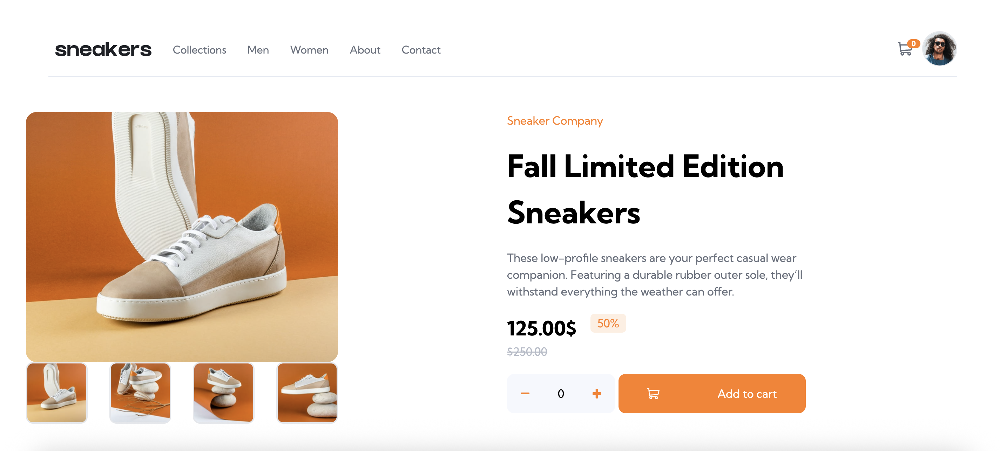

## Table of contents

- [Overview](#overview)
- [The challenge](#the-challenge)
- [Screenshot](#screenshot)
- [Built with](#built-with)

## Overview

- This is an e-commerce product page. user can add to cart shoe based on their choice clicking on the add to cart button after selecting desire number of shoe

### The challenge

Users should be able to:

- View the optimal layout for the site depending on their device's screen size
- See hover states for all interactive elements on the page
- Open a lightbox gallery by clicking on the large product image
- Switch the large product image by clicking on the small thumbnail images
- Add items to the cart
- View the cart and remove items from it

### Screenshot

### Links

- Solution URL: [solution here](https://github.com/nasim67reja/Ecommerce.github.io)
- Live Site URL: [ live site here](https://nasim67reja.github.io/Ecommerce.github.io/)

### Built with
- React
- Typescript 
- Tailwind
- Desktop-first workflow
